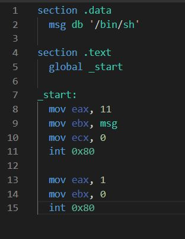
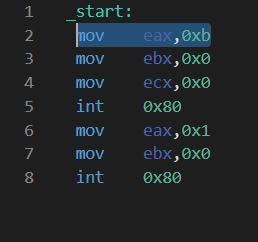

Followings are the major memory segments and registers which plays important roll in ShellCodding. 

  The stack segment (For function calls (dynamic)).
  
  The heap segment (For dynamicly allocating memory).
  
  The data segment (Variables).
  
  The bss segment (Variables).
  
  The text segment (Set of instructions (The actual code)).
  
  
  >The EAX register
  
  >The EBX register
  
  >The ECX register
  
  >The EDX register
  
  >The ESP register
  
  
  Important Assembly Insrtuctions.
  
  MOV (assign, for example MOV EAX, 32 (EAX = 32)).
  XOR (Exclusive OR, for example XOR EAX, EAX)
  PUSH (Push something on the stack, example: PUSH EAX).
  POP (Load what was on the stack in a register/variable, example: POP EBX).
  CALL (Call a function, for example: CALL FuncPrint).
  INT (Interrupt, kernel command, for example INT 0x80 which is used in calling syscalls).
  
  what is "SYSCALL"
   
   The system call is the fundamental interface between an application and the Linux kernel.{instratuctions that kernol can recognize}
   important they dont use stack.
   
   we need a assemply code.
   simple programe.
   
 section .data
   msg db '/bin/sh';
 
section .text
  global _start;
 
_start:
  mov eax, 11 ;
  mov ebx, msg;
  mov ecx, 0;
  int 0x80;
 
  mov eax, 1;
  mov ebx, 0; 
  int 0x80; 
   
   
   
   
   
   assamble code image
   
   lets extract the shell code
   
   
   
   corresponding shell code fpr above assembly code.
   
   "\xb8\x0b\x00\x00\x00\x00\xbb\xa0\x90\x04\x08\xb9\x00\x00\x00\x00\x00\xcd\x80\xb8\x01\x00\x00\x00\xbb\x00\x00\x00\x00\xcd\x80"
   
   
   ---------------------------------------------------------------------
   
   Solving the nullbyte Issue
   
   
   >what is nullbyte
   >why?
   >how to fix that problem
   
   
   
   
   
   
  
  
  
  
